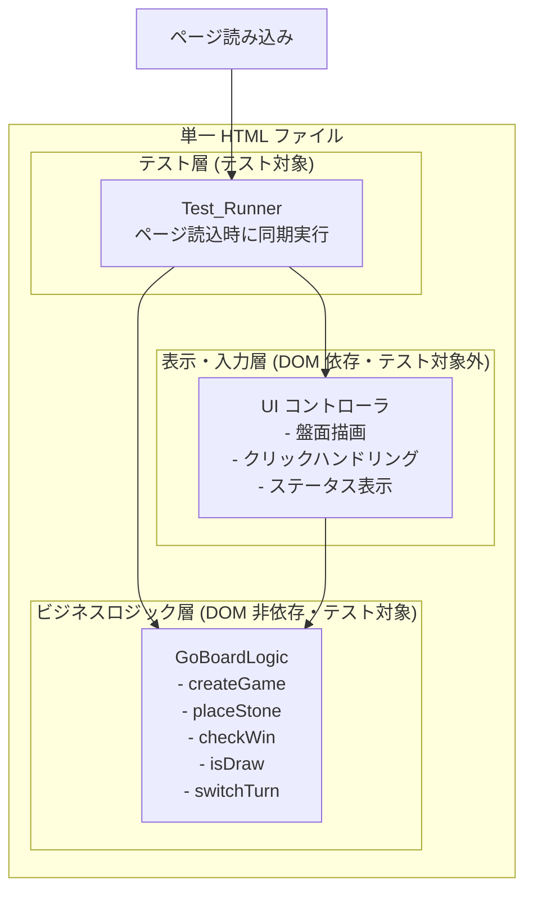

# Design Document

## Overview

GoBoard は、15×15 の格子盤上で 2 人のプレイヤーが交互に石を置き、
縦・横・斜めのいずれかの方向に同じ色の石を 5 つ連続で並べたプレイヤーが勝利するボードゲームである。

本設計では、ゲーム全体を単一の HTML ファイルとして実装する。
CSS は `<style>`、JavaScript は `<script>` としてインラインで記述し、
ビルド工程・外部ライブラリ・CDN・Web フォントは一切使用しない。
必要な機能はブラウザ標準の API のみで実装する。

設計の中心的な方針は、UI に依存しないビジネスロジックを
DOM から完全に分離した純粋な関数群として切り出すことである。
盤面状態の管理・勝敗判定・手番制御はいずれも副作用を持たず、
入力状態から新しい状態（または判定結果）を返す純粋関数として実装する。
これにより、DOM を用意できない環境でも同じロジックをテストでき、
ページ読み込み時に自動テストを同期的に実行できる。

### 設計上の主要な決定

| 決定 | 理由 |
|------|------|
| ビジネスロジックを純粋関数（`GoBoardLogic`）として分離する | DOM 非依存で単体テスト・プロパティテストが可能になる（要件 7） |
| 状態を不変オブジェクトとして扱い、着手ごとに新しい状態を返す | 副作用を排除し、テスト容易性と予測可能性を高める |
| 勝敗判定は着手された交点を起点に 4 方向のみ走査する | 盤面全体の全走査を避け、判定ロジックを局所化して検証しやすくする |
| Test_Runner を UI 初期化の前に同期実行する | 回帰をゲーム起動前に検知し、失敗しても UI を止めない（要件 7.1, 7.5） |

## Architecture

システムは 3 つの層に分かれる。ビジネスロジック層のみがテスト対象であり、
表示層・入力層は DOM に依存するためテスト対象外とする。



処理の流れ:

1. ページ読み込み完了時、まず Test_Runner が `GoBoardLogic` に対する全テストを同期的に実行し、結果を `console.log` へ出力する。
2. テストの成否にかかわらず（例外を送出せず）、UI コントローラが初期状態のゲームを生成して盤面を描画する。
3. プレイヤーが交点をクリックすると、UI コントローラが `GoBoardLogic.placeStone` を呼び出して新しい状態を得る。
4. UI コントローラは返された状態と着手結果に基づいて盤面・ステータス表示を更新する。

## Components and Interfaces

### GoBoardLogic（ビジネスロジック層）

DOM に一切依存しない純粋関数群。すべての関数は入力状態を変更せず、新しい値を返す。

```javascript
/**
 * 新しいゲーム状態を生成する。
 * @returns {GameState} 空盤・黒番・進行中の初期状態
 */
function createGame()

/**
 * 指定した交点に現在の手番の石を置こうと試みる。
 * 状態は変更せず、新しい状態を含む結果を返す。
 * @param {GameState} state 現在のゲーム状態
 * @param {number} row 行番号
 * @param {number} col 列番号
 * @returns {MoveResult} 着手の可否・理由・新しい状態
 */
function placeStone(state, row, col)

/**
 * 指定した交点を起点に、その交点の石の色で 5 連が成立しているか判定する。
 * @param {Board} board 盤面
 * @param {number} row 起点の行
 * @param {number} col 起点の列
 * @returns {boolean} 5 連が成立していれば true
 */
function checkWin(board, row, col)

/**
 * 盤面上のすべての交点が石で埋まっているか判定する。
 * @param {Board} board 盤面
 * @returns {boolean} 全交点が埋まっていれば true
 */
function isBoardFull(board)

/**
 * 手番の色を他方に切り替えた色を返す。
 * @param {Color} turn 現在の手番の色
 * @returns {Color} 他方の色
 */
function nextTurn(turn)

/**
 * 座標が盤内かつ整数であるかを検証する。
 * @param {number} row 行番号
 * @param {number} col 列番号
 * @returns {boolean} 有効な座標なら true
 */
function isValidCoordinate(row, col)
```

`MoveResult` は着手の可否・無効理由・結果状態を表す。

```javascript
/**
 * @typedef {Object} MoveResult
 * @property {boolean} valid              着手が有効だったか
 * @property {string|null} reason         無効理由コード（valid が false のとき）
 * @property {GameState} state            着手後の状態（無効時は入力状態と同一内容）
 */
```

無効理由コードは以下のいずれか。

| reason コード | 意味 | 対応要件 |
|---------------|------|----------|
| `OCCUPIED` | 既に石がある交点への着手 | 3.1, 6.4 |
| `OUT_OF_BOUNDS` | 行または列が 0〜14 の範囲外 | 3.2 |
| `INVALID_COORDINATE` | 行または列が整数でない値 | 3.3 |
| `NOT_IN_PROGRESS` | ゲームが進行中でない状態での着手 | 3.4, 5.4 |

### Test_Runner（テスト層）

`console.log` にテスト結果を出力する簡易テストランナー。外部ランナーは使わない。

```javascript
/**
 * テストを 1 件登録する。
 * @param {string} name テスト名
 * @param {() => void} fn 本体（アサーション失敗時は例外を送出する）
 */
function test(name, fn)

/**
 * 登録済みの全テストを同期実行し、結果を console.log に出力する。
 * いずれのテストが失敗しても例外を外へ伝播させない。
 * @returns {{ total: number, passed: number, failed: number }} サマリ
 */
function runTests()

/**
 * 期待値と実際値が等しくない場合に、期待値・実際値を含めて例外を送出する。
 */
function assertEqual(actual, expected, message)
```

### UI コントローラ（表示・入力層）

DOM を生成・更新し、クリックイベントを `GoBoardLogic` の呼び出しへ橋渡しする。
この層は自動テストの対象外であり、`GoBoardLogic` の純粋関数を利用する。

主な責務:

- 15×15 の交点を持つ盤面を描画する。
- 交点クリック時に `placeStone` を呼び出し、返された状態で再描画する。
- Game_Status（進行中・黒勝ち・白勝ち・引き分け）を画面に表示する。
- 着手拒否時に、その理由（既に石がある等）をユーザーに提示する。

## Data Models

### Color

石および手番の色を表す。

```javascript
const Color = Object.freeze({
  BLACK: 'BLACK',
  WHITE: 'WHITE',
});
```

### CellState

各交点の状態を表す。「空」を含む。

```javascript
const CellState = Object.freeze({
  EMPTY: 'EMPTY',
  BLACK: 'BLACK',
  WHITE: 'WHITE',
});
```

### GameStatus

ゲームの進行状態を表す。

```javascript
const GameStatus = Object.freeze({
  IN_PROGRESS: 'IN_PROGRESS',
  BLACK_WIN: 'BLACK_WIN',
  WHITE_WIN: 'WHITE_WIN',
  DRAW: 'DRAW',
});
```

### Board

15×15 の交点集合。`board[row][col]` が各交点の `CellState` を保持する 2 次元配列。
行・列ともに 0〜14 の範囲を取り、合計 225 個の交点を持つ。

```javascript
/**
 * @typedef {CellState[][]} Board  // 15 行 × 15 列
 */
const BOARD_SIZE = 15;
const WIN_LENGTH = 5;
```

### GameState

ゲーム全体の状態。着手ごとに新しいインスタンスとして生成され、既存インスタンスは変更しない。

```javascript
/**
 * @typedef {Object} GameState
 * @property {Board} board            15×15 の盤面
 * @property {Color} currentTurn      現在の手番の色（Current_Turn）
 * @property {string} status          GameStatus のいずれか
 */
```

初期状態（`createGame` の返り値）:

- `board`: 全 225 交点が `CellState.EMPTY`
- `currentTurn`: `Color.BLACK`（先手は黒）
- `status`: `GameStatus.IN_PROGRESS`

### Line（勝敗判定の走査方向）

勝敗判定では、着手された交点を起点に 4 つの方向についてそれぞれ両側へ同色の連続数を数える。

```javascript
const DIRECTIONS = [
  { dr: 0, dc: 1 },   // 横
  { dr: 1, dc: 0 },   // 縦
  { dr: 1, dc: 1 },   // 右下がり斜め
  { dr: 1, dc: -1 },  // 右上がり斜め
];
```

各方向について「起点から正方向の連続数 + 起点 + 負方向の連続数」を合計し、
`WIN_LENGTH`（5）以上であれば 5 連成立とみなす。

## Correctness Properties

*プロパティとは、システムのすべての妥当な実行にわたって成り立つべき特性や振る舞いのことである。
すなわち、システムが何をすべきかについての形式的な言明であり、人間が読める仕様と
機械的に検証可能な正しさの保証との橋渡しとなる。*

以下のプロパティは、DOM に依存しない `GoBoardLogic` の純粋関数に対して定義される。
各プロパティはプロパティベーステスト（最低 100 回のランダム反復）として実装される。

### Property 1: 有効着手は手番の色の石を配置する

*任意の* 進行中の GameState と、その盤面上で空である任意の交点について、
その交点へ着手すると、着手後の盤面において当該交点は着手前の Current_Turn の色になり、
着手結果は有効（valid=true）となる。

**Validates: Requirements 2.1, 3.5**

### Property 2: 有効かつ非決着の着手は手番を他方へ切り替える

*任意の* 進行中の GameState と任意の空交点について、
着手の結果 Win_Condition と引き分けのいずれも成立しない場合、
着手後の Current_Turn は着手前の Current_Turn の他方の色になる。

**Validates: Requirements 2.4**

### Property 3: 無効な着手は状態を変えず対応する理由を返す

*任意の* GameState と、次のいずれかに該当する無効な着手について、
着手結果は valid=false となり、盤面と Current_Turn は着手前と等しいまま保持され、
無効理由が該当する条件に一致する。

- 既に石のある交点への着手 → 理由 `OCCUPIED`
- 行または列が 0〜14 の範囲外の着手 → 理由 `OUT_OF_BOUNDS`
- 行または列が整数でない（小数・null・undefined・NaN・非数値を含む）着手 → 理由 `INVALID_COORDINATE`
- Game_Status が進行中以外（勝ち・白勝ち・引き分け）のときの着手 → 理由 `NOT_IN_PROGRESS`

**Validates: Requirements 2.2, 2.3, 3.1, 3.2, 3.3, 3.4, 4.6, 5.3, 5.4, 6.2, 6.3, 6.4**

### Property 4: いずれかの方向に 5 連が揃うと対応する色の勝ちになる

*任意の* 色、任意の方向（縦・横・右上がり斜め・右下がり斜め）、
および盤内に収まる任意の開始位置について、
その方向へ同じ色の石が 5 つ連続するように着手列を適用すると、
最後の着手の後に Game_Status はその石の色に対応する勝ち（黒なら BLACK_WIN、白なら WHITE_WIN）になる。

**Validates: Requirements 4.1, 4.2, 4.3, 4.4**

### Property 5: 複数方向で同時に 5 連が成立しても勝ちは単一の結果になる

*任意の* 色について、その色の石が複数の方向で同時に 5 連を成立させる着手をしたとき、
Game_Status はその色の勝ち 1 つ（単一の値）に設定され、他方の勝ちや引き分けと矛盾しない。

**Validates: Requirements 4.5**

### Property 6: 有効着手は着手した交点以外の既存の石を変更しない

*任意の* 進行中の GameState への任意の有効な着手について、
着手後の盤面では、着手した交点以外のすべての交点の状態が着手前と等しく、
既に置かれていた石の色は変化しない。

**Validates: Requirements 6.1**

### Property 7: 盤が満杯で勝者がいなければ引き分けになる

*任意の* 勝者を生じない満杯盤面を構成する着手列について、
盤上の全 225 交点が石で埋まり Win_Condition が成立していない状態に到達したとき、
Game_Status は引き分け（DRAW）に設定される。

**Validates: Requirements 5.1**

### Property 8: 新しいゲームの生成は既存状態に依存しない

*任意の* 着手列を適用した後の GameState が存在しても、
`createGame()` は常に、全 225 交点が空・Current_Turn が黒・Game_Status が進行中である
同一の初期状態を返す。

**Validates: Requirements 1.5**

## Error Handling

エラー処理はビジネスロジック層とテスト層の両方で「例外を投げず結果値で表現する」方針を取る。

| 状況 | 扱い | 対応要件 |
|------|------|----------|
| 石のある交点への着手 | `placeStone` が valid=false, reason=OCCUPIED の MoveResult を返し、状態は不変 | 3.1, 6.2, 6.4 |
| 盤外座標への着手 | valid=false, reason=OUT_OF_BOUNDS を返す（例外は投げない） | 3.2 |
| 整数でない座標への着手 | 座標を検証し valid=false, reason=INVALID_COORDINATE を返す | 3.3 |
| 進行中でない状態での着手 | valid=false, reason=NOT_IN_PROGRESS を返す | 3.4, 5.4 |
| テストの失敗 | Test_Runner が失敗を記録・出力するが、例外を外へ伝播させない | 7.4, 7.5 |
| いずれかのテストが失敗した状態でのゲーム起動 | テスト完了後、例外を送出せず UI 初期化を通常どおり継続する | 7.5 |

`GoBoardLogic` の関数は入力状態を破壊しない。無効な着手でも入力の GameState は変更されず、
UI 層は返された MoveResult の `valid` と `reason` を見て表示を切り替える。

## Testing Strategy

### テスト方針

本フィーチャーのビジネスロジックは DOM 非依存の純粋関数であり、
入力によって挙動が変わる不変条件・ラウンドトリップ・冪等性を多く含むため、
プロパティベーステスト（PBT）が適切である。
DOM 操作・描画・イベントハンドリング・表示（要件 5.2 の引き分け表示など）は
UI 層の責務であり、自動テストの対象外とする（steering の方針に準拠）。

テストはブラウザ標準の API のみで実装し、外部テストランナーは使わない。
テストコードは同一 HTML ファイル内に記述し、ページ読み込み時に UI 初期化前へ同期実行する。

### プロパティベーステスト

- 対象言語は JavaScript。既存の軽量プロパティテスト方式を自前の最小ジェネレータで実装する
  （外部ライブラリ・CDN は使用できないため、乱数ジェネレータとランダム入力生成を
  ブラウザ標準の `Math.random` を用いて自作する）。
- 各プロパティテストは最低 100 回のランダム反復を行う。
- 各プロパティテストには、対応する設計プロパティを参照するコメントを付与する。
- コメントのタグ形式: `Feature: goboard, Property {番号}: {プロパティ本文}`
- 上記の各 Correctness Property を、それぞれ 1 つのプロパティベーステストとして実装する。

ジェネレータの設計要点:

- ランダムな進行中 GameState を生成する（勝敗が確定しない範囲でランダムに石を配置）。
- ランダムな空交点・ランダムな範囲外座標・不正座標（小数・null・undefined・NaN・文字列）を生成する。
- 5 連構成用に、任意の色・方向・盤内開始位置から 5 連となる着手列を生成する。

### 単体テスト（例・エッジケース）

プロパティで覆いにくい決定的なケースは例ベースの単体テストで補う。

| テスト | 内容 | 対応要件 |
|--------|------|----------|
| 初期盤面 | createGame() の全 225 交点が空・着手済み 0 個 | 1.1, 1.4, 7.6 |
| 初期手番 | createGame().currentTurn が黒 | 1.2, 7.6 |
| 初期ステータス | createGame().status が進行中 | 1.3, 7.6 |
| 初手の色 | createGame() 直後の着手で黒石が置かれる | 2.5, 7.7 |
| 手番の交互切替 | 有効着手ごとに黒→白→黒と交互に切り替わる | 2.4, 7.8 |
| 非決着盤面 | 5 連のない盤面で Game_Status が進行中のまま | 4.1〜4.4 の否定, 7.18 |

要件 7.6〜7.20 が Test_Runner に求める各検証項目は、
上記のプロパティベーステストおよび例ベース単体テストとして実装することで満たす。

### Test_Runner のスモーク確認

Test_Runner 自身（出力形式・同期実行・例外非伝播）は自動テストの対象外とし、
実装上の配線として担保する。ページ読み込み時に console へ各テストの成否と
サマリ（総数・成功数・失敗数）が出力されること、
テスト失敗時も UI が通常どおり初期化されることを目視で確認する（要件 7.1〜7.5）。
