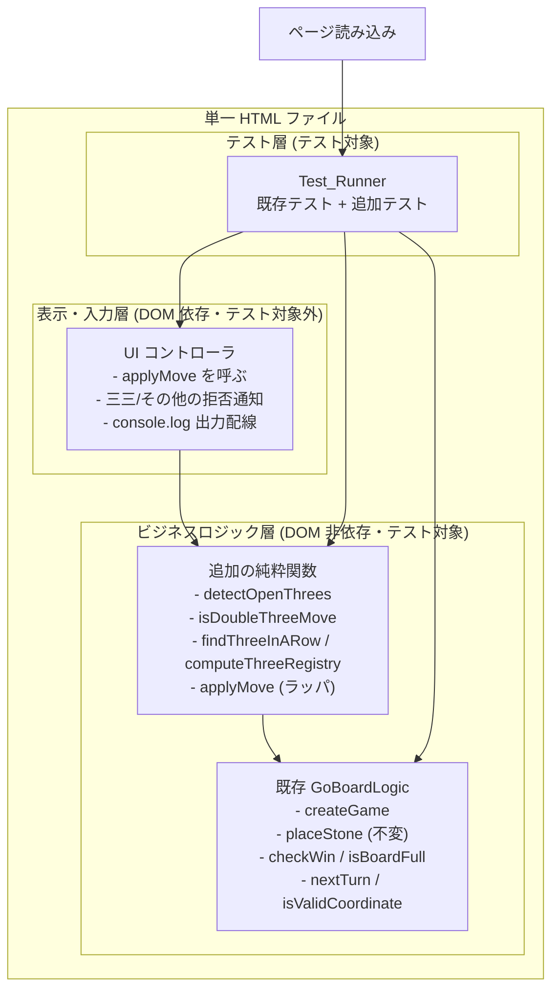

# Design Document

## Overview

本設計は、既存の GoBoard に「三三の禁止（Double_Three 禁止）」というローカルルールを追加する。
Black_Player の 1 手が、その着手した Stone を含む Open_Three を相異なる 2 方向以上で同時に
成立させる（Double_Three となる）場合、その着手を無効として Stone を配置しない。あわせて、
盤面上で成立している Three_In_A_Row の位置を黒・白それぞれについて記憶する Three_Registry を
導入し、着手が確定するたびに再計算する。さらに、着手のたびに黒・白それぞれの Three_In_A_Row の
有無と個数を console.log に出力する。

設計の最重要方針は、既存ロジックへの影響範囲を最小化することである（Requirement 5）。
既存の `GoBoardLogic.placeStone` の署名・振る舞いは、Black_Player の Double_Three ケースを除いて
一切変更しない。三三判定・Three_Registry の再計算・ログ出力・拒否メッセージはいずれも
**追加的（additive）** な純粋関数および薄いラッパとして実装し、既存の盤面初期化・交互着手・
妥当性検証・勝敗判定・引き分け判定の内部を書き換えない。

実装は引き続き HTML + CSS + JavaScript の 1 ファイル構成を維持し、外部ライブラリおよび CDN を
一切使用しない。追加するビジネスロジックはすべて DOM に依存しない純粋関数として切り出し、
ページ読み込み時の自動テストから参照できる形にする。

### 設計上の主要な決定

| 決定 | 理由 |
|------|------|
| 三三判定を `placeStone` 内部に混ぜず、新しいラッパ関数 `applyMove` で層として重ねる | 既存 `placeStone` の署名・振る舞いを不変に保ち、回帰リスクを最小化する（要件 5.1, 5.2） |
| Open_Three 検出・Three_Registry 再計算を独立した純粋関数として切り出す | DOM 非依存で単体・プロパティテストが可能になり、三三判定と登録処理を局所化できる（要件 5.3） |
| 三三禁止用に新しい InvalidReason（`DOUBLE_THREE`）を追加する | 既存の拒否理由（OCCUPIED 等）と区別でき、通知領域で別メッセージを提示できる（要件 4.2, 4.3） |
| Win_Condition を三三判定より先に評価する | 5 連が成立する着手は三三禁止より優先して勝ちとする（要件 1.4） |
| Three_Registry は確定後の盤面全体を走査して毎回再計算する | 差分更新の複雑さを避け、確定後盤面と登録内容の一致を保証する（要件 2.2, 2.4） |
| ログ出力・拒否メッセージ表示は UI/起動配線側で行い、純粋関数は値を返すだけにする | ビジネスロジックの DOM 非依存を維持する（要件 5.3） |

## Architecture

既存の 3 層構造（ビジネスロジック層・テスト層・表示/入力層）を維持し、
本機能はビジネスロジック層への **追加関数** と、表示/入力層・起動配線での
**ログ出力および通知の分岐** として組み込む。



着手処理の流れ（UI からの 1 クリック）:

1. UI コントローラは `placeStone` ではなく新しいラッパ `applyMove(state, row, col)` を呼ぶ。
2. `applyMove` は内部で既存 `placeStone` を呼び、まず基本ルール（進行中判定・座標・既石・
   勝敗・引き分け・手番切替）の結果を得る。
3. `placeStone` が無効を返した場合は、その結果をそのまま返す（既存の拒否理由がそのまま伝わる）。
4. `placeStone` が有効を返した場合、`applyMove` は次の順で三三禁止を評価する。
   - 着手後の Game_Status が Win_Condition（BLACK_WIN）なら、三三禁止を適用せずその勝ちを優先する（要件 1.4）。
   - 着手前の手番が Black_Player で、かつ着手が Double_Three を成立させるなら、
     結果を無効（reason=DOUBLE_THREE）に差し替え、状態は **着手前の state** に戻して返す（要件 1.1, 4.1）。
   - それ以外（白の着手・黒の単方向 Open_Three・三を作らない手）は有効のまま受理する（要件 1.2, 1.3）。
5. 有効が確定した場合、`applyMove` は確定後の盤面から Three_Registry を再計算して結果に含める（要件 2.2）。
6. UI コントローラは、有効なら盤面・ステータスを再描画し（通知はクリア）、Three_Registry に基づく
   ログを出力する（要件 3.1〜3.3）。無効なら reason に応じた通知を提示し、ログは出力しない（要件 3.4, 4.2, 4.3）。

この流れにおいて、既存 `placeStone` は呼び出されるだけで内部は変更されない。三三禁止は
`placeStone` が有効と判定した結果を **後段で覆す** 形でのみ介入するため、既存の各判定の
入出力は同一入力に対して同一のまま保たれる（要件 5.2）。

## Components and Interfaces

### 追加する GoBoardLogic 関数（ビジネスロジック層）

いずれも DOM 非依存の純粋関数であり、入力状態を変更せず新しい値を返す。
既存関数（`createGame`, `placeStone`, `checkWin`, `isBoardFull`, `nextTurn`, `isValidCoordinate`）は
そのまま維持し、以下を `GoBoardLogic` の公開 API に追加する。

```javascript
/**
 * 指定した交点に指定色の石を置いたと仮定したとき、その石を含む Open_Three が
 * 成立している方向の集合を返す。盤面は変更しない。
 * @param {Board} board            判定対象の盤面（着手を反映済みの盤面を渡す）
 * @param {number} row             判定の中心となる交点の行
 * @param {number} col             判定の中心となる交点の列
 * @param {Color} color            判定対象の色
 * @returns {{dr:number, dc:number}[]} Open_Three が成立している相異なる Line 方向の配列
 */
function detectOpenThrees(board, row, col, color)

/**
 * 着手後の盤面において、着手交点を含む Open_Three が相異なる 2 方向以上で
 * 成立しているか（Double_Three か）を判定する。
 * @param {Board} board            着手を反映済みの盤面
 * @param {number} row             着手交点の行
 * @param {number} col             着手交点の列
 * @param {Color} color            着手した色
 * @returns {boolean}              Double_Three なら true
 */
function isDoubleThreeMove(board, row, col, color)

/**
 * 盤面全体を走査し、指定色の Three_In_A_Row（同色ちょうど 3 個連続）の位置集合を返す。
 * 各 Three_In_A_Row は、それを構成する 3 交点の正規化された座標列で一意に表す。
 * @param {Board} board            走査対象の盤面
 * @param {Color} color            対象の色
 * @returns {ThreeInARow[]}        重複を含まない Three_In_A_Row の集合
 */
function findThreeInARow(board, color)

/**
 * 確定後の盤面から黒・白それぞれの Three_In_A_Row 位置集合を再計算し、
 * Three_Registry を新規に構築して返す。
 * @param {Board} board            確定後の盤面
 * @returns {ThreeRegistry}        黒・白を区別した Three_In_A_Row の集合
 */
function computeThreeRegistry(board)

/**
 * 三三禁止ローカルルールを含めて着手を適用するラッパ。
 * 内部で既存 placeStone を呼び、その有効結果に対してのみ三三禁止と
 * Three_Registry 再計算を適用する。placeStone 自体は変更しない。
 * @param {GameState} state        現在のゲーム状態
 * @param {number} row             行番号
 * @param {number} col             列番号
 * @returns {LocalMoveResult}      着手の可否・理由・新状態・Three_Registry
 */
function applyMove(state, row, col)
```

### 拡張する MoveResult（LocalMoveResult）

`applyMove` は既存 `MoveResult`（`valid`, `reason`, `state`）を包含しつつ、確定後の
Three_Registry を追加で返す。既存 `placeStone` の返り値形は変更しない。

```javascript
/**
 * @typedef {Object} LocalMoveResult
 * @property {boolean} valid              着手が有効だったか
 * @property {string|null} reason         無効理由コード（valid が false のとき）
 * @property {GameState} state            着手後の状態（無効時は着手前と同一内容）
 * @property {ThreeRegistry} registry     確定後盤面に基づく Three_Registry
 *                                        （無効時は着手前の Three_Registry と同一内容）
 */
```

無効理由コードは既存の 4 種に加え、三三禁止用の 1 種を追加する。

| reason コード | 意味 | 追加/既存 | 対応要件 |
|---------------|------|-----------|----------|
| `OCCUPIED` | 既に石がある交点への着手 | 既存 | 4.3 |
| `OUT_OF_BOUNDS` | 行または列が 0〜14 の範囲外 | 既存 | 4.3 |
| `INVALID_COORDINATE` | 行または列が整数でない値 | 既存 | 4.3 |
| `NOT_IN_PROGRESS` | ゲームが進行中でない状態での着手 | 既存 | 4.3 |
| `DOUBLE_THREE` | Black_Player の着手が Double_Three を成立させる | 追加 | 1.1, 4.2 |

### UI コントローラ（表示・入力層）

既存の責務に、次の分岐を **追加** する。ビジネスロジックは値を返すだけとし、
DOM 参照・console 出力の副作用は本層に閉じる（要件 5.3）。

- クリック時に `placeStone` ではなく `applyMove` を呼ぶ。
- 有効な着手: 盤面・ステータスを再描画し、通知領域をクリアする（要件 4.4）。続けて、
  返された Three_Registry を用いて黒・白それぞれの Three_In_A_Row の有無と個数を
  console.log へ出力する（要件 3.1〜3.3）。
- 無効な着手: reason に応じたメッセージを通知領域（#gb-notice）へ提示する。
  `DOUBLE_THREE` は「三三禁止により着手できない」旨の、他の拒否理由と区別できる
  メッセージにする（要件 4.2, 4.3）。この場合、Three_In_A_Row の有無ログは出力しない（要件 3.4）。

### Test_Runner（テスト層）

既存の `test` / `assertEqual` / `runTests` および `GB_GEN` をそのまま用い、
本機能のプロパティテスト・単体テストを **追加登録** する。既存テストは変更しない（要件 5.5）。

## Data Models

既存の `Color` / `CellState` / `GameStatus` / `Board`（`BOARD_SIZE=15`, `WIN_LENGTH=5`）/
`GameState` / `DIRECTIONS`（横・縦・右下がり斜め・右上がり斜めの 4 方向）はすべて維持する。
本機能では次の定数・型を追加する。

### THREE_LENGTH（Three_In_A_Row の長さ）

Three_In_A_Row および Open_Three の判定に用いる「ちょうど 3 個」という長さ定数。

```javascript
/** Three_In_A_Row を構成する同色連続数。 */
const THREE_LENGTH = 3;
```

### InvalidReason の拡張

既存の `InvalidReason` に三三禁止の理由コードを 1 つ追加する。既存値は変更しない。

```javascript
const InvalidReason = Object.freeze({
  OCCUPIED: 'OCCUPIED',
  OUT_OF_BOUNDS: 'OUT_OF_BOUNDS',
  INVALID_COORDINATE: 'INVALID_COORDINATE',
  NOT_IN_PROGRESS: 'NOT_IN_PROGRESS',
  DOUBLE_THREE: 'DOUBLE_THREE', // 追加：Black_Player の三三禁止
});
```

### ThreeInARow

盤面上で成立している 1 つの Three_In_A_Row を、それを構成する 3 交点の座標列で表す。
同一の並びを一意に識別できるよう、座標列は正規化する（下記「Three_In_A_Row の正規化」を参照）。

```javascript
/**
 * @typedef {Object} ThreeInARow
 * @property {Color} color                        並びの色
 * @property {{row:number, col:number}[]} cells   構成する 3 交点（正規化済み・昇順）
 * @property {string} key                         重複排除用の正規化キー文字列
 */
```

### ThreeRegistry

黒・白それぞれの Three_In_A_Row 集合を区別して保持する。同一の Three_In_A_Row を
重複して持たない（要件 2.4）。

```javascript
/**
 * @typedef {Object} ThreeRegistry
 * @property {ThreeInARow[]} black   黒の Three_In_A_Row 集合（重複なし）
 * @property {ThreeInARow[]} white   白の Three_In_A_Row 集合（重複なし）
 */
```

初期状態（新規ゲーム開始時）は黒・白いずれも空配列とする（要件 2.1）。
`createGame` は既存どおり GameState のみを返し、Three_Registry は UI/起動配線側で
`computeThreeRegistry(createGame().board)`（＝空盤に対して黒・白とも 0 個）として初期化する。
これにより `createGame` の署名・振る舞いは不変に保たれる（要件 5.2）。

## Open_Three 検出アルゴリズム

三三判定の中核は、着手交点を含む Open_Three が各 Line 方向で成立しているかの判定である。
以下では 1 方向についての判定を定義する。全 4 方向に同じ判定を適用し、成立方向を数える。

### 用語と前提

- 方向は `DIRECTIONS` の 4 つ（横・縦・右下がり斜め・右上がり斜め）。各方向は `{dr, dc}` と
  その反対向き `{-dr, -dc}` の両側からなる 1 本の Line を表す。
- 判定対象は「着手した Stone を含む同色ちょうど 3 個」の並びであり、
  次の 2 パターンのいずれかを指す。
  - **連続 3（contiguous-3）**: 同色 3 個が隙間なく連続する（例: `X X X`）。
  - **単一飛び 3（single-gap-3）**: 同色 3 個の内部に空 Intersection をちょうど 1 か所だけ
    挟む（例: `X X _ X` の一部としての `X _ X` ＋ もう 1 つ、すなわち 3 個の石＋内部空 1）。
    具体的には、Line 上の連続 4 マスのうち「石・石・空・石」または「石・空・石・石」の形で、
    同色石が 3 個・内部空が 1 個の並び。

### 判定手順（1 方向あたり）

着手交点を `p`、着手色を `c`、方向を `d = {dr, dc}` とする。

1. **同色 3 個の並び（窓）の列挙**: `p` を含み、方向 `d` に沿った長さ 3〜4 の窓のうち、
   「同色 `c` の石をちょうど 3 個含み、`c` 以外の石（相手の石）を含まず、内部の空が
   連続 3 の場合 0 個・単一飛び 3 の場合ちょうど 1 個」であるものを候補とする。
   窓は `p` を必ず含むものだけを対象とする（着手した Stone を含む Open_Three のみ判定するため）。
2. **両端の延長可能性（Open 条件）**: 候補の並びについて、その並びが占める Line 区間の
   両端の外側 1 マス（前端側・後端側）を調べる。並び全体を延長して、相手の Stone または
   盤端に妨げられずに **同色 4 個の連続（Open_Four に発展し得る形）を新たに作り得る** とき、
   その並びを Open_Three とみなす。
   - 具体的な充足条件: 並びの前端外側・後端外側のうち少なくとも一方が空 Intersection であり、
     かつその空へ石を置くことで（連続 3 の場合はその隣接空、単一飛び 3 の場合は内部空の
     充填または端の伸長により）同色 4 連を形成できる余地が盤内に存在すること。
   - 両端側のいずれもが相手の Stone または盤端で塞がれ、4 連を作り得ない場合は Open_Three では
     ない（要件の Glossary に準拠）。
3. **方向の成立判定**: 上記 1〜2 を満たす窓が方向 `d` に 1 つでも存在すれば、
   その方向は「着手交点を含む Open_Three が成立している方向」とする。
   同一方向内に複数の窓があっても、その方向の成立は 1 回として数える（方向単位で数える）。

### Double_Three 判定

`detectOpenThrees(board, row, col, color)` は上記手順を 4 方向すべてに適用し、
成立した相異なる方向の集合を返す。`isDoubleThreeMove` はその集合の要素数が 2 以上であれば
`true` を返す。方向は `DIRECTIONS` の 4 本を単位とし、同一 Line 上の複数の窓は 1 方向として扱う
ため、「相異なる 2 方向以上」＝「異なる Line が 2 本以上」で Double_Three が成立する（要件 1.1）。

Win_Condition 優先の扱いは `applyMove` 側で行う。すなわち、着手後の盤面で `checkWin` が真
（5 連成立）となる場合、`isDoubleThreeMove` の結果にかかわらず三三禁止を適用しない（要件 1.4）。

## Three_In_A_Row の正規化と Three_Registry の再計算

### Three_In_A_Row の正規化

同一の並びを重複なく一意に識別するため、Three_In_A_Row を構成する 3 交点の座標列を
`(row, col)` の辞書順で昇順ソートし、その並びを重複排除キー `key` とする（要件 2.4）。
連続 3 と単一飛び 3 のいずれも、実際に石が存在する 3 交点の座標のみをキーの構成に用いる
（内部の空 Intersection はキーに含めない）。同一の 3 石集合は、走査の起点や方向の取り方に
よらず同じ `key` を持つため、集合として重複しない。

### computeThreeRegistry

`computeThreeRegistry(board)` は確定後の盤面全体を走査し、黒・白それぞれについて成立している
Three_In_A_Row（連続 3 と単一飛び 3 の両方）を列挙し、`key` により重複排除して
`{ black: ThreeInARow[], white: ThreeInARow[] }` を新規構築して返す（要件 2.2）。
本関数は盤面を変更せず、既存の Three_Registry も参照しないため、確定後盤面に対して
毎回同じ結果を返す（要件 2.2, 2.4）。

`applyMove` は、着手が有効に確定したときのみこの関数を呼んで新しい Three_Registry を作る。
着手が無効（既石・範囲外・不正座標・終局・三三禁止）の場合は再計算せず、着手前の
Three_Registry と同一内容を返す（要件 2.3, 3.4）。

## Correctness Properties

*プロパティとは、システムのすべての妥当な実行にわたって成り立つべき特性や振る舞いのことである。
すなわち、システムが何をすべきかについての形式的な言明であり、人間が読める仕様と
機械的に検証可能な正しさの保証との橋渡しとなる。*

以下のプロパティは、DOM に依存しない追加の純粋関数（`applyMove`, `detectOpenThrees`,
`isDoubleThreeMove`, `computeThreeRegistry`）に対して定義される。
各プロパティはプロパティベーステスト（最低 100 回のランダム反復）として実装される。

### Property 1: 黒の三三着手は無効となり状態を変えない

*任意の* 進行中の GameState と、Black_Player の手番における空交点への着手について、
その着手が着手後盤面で相異なる 2 方向以上の Open_Three を成立させ（Double_Three）、
かつ Win_Condition を成立させないならば、`applyMove` の結果は valid=false・reason=DOUBLE_THREE となり、
盤面・Current_Turn・Game_Status・Three_Registry はいずれも着手前と等しいまま保持される。

**Validates: Requirements 1.1, 4.1**

### Property 2: 黒の単方向 Open_Three の着手は受理される

*任意の* 進行中の GameState と、Black_Player の空交点への着手について、
その着手が Open_Three をちょうど 1 方向でのみ成立させ、かつ Win_Condition を成立させないならば、
`applyMove` の結果は valid=true となり、当該交点に黒の Stone が配置される。

**Validates: Requirements 1.2**

### Property 3: 白の三三着手は受理される

*任意の* 進行中の GameState で Current_Turn が White_Player のとき、
着手が相異なる 2 方向以上で Open_Three を成立させても、`applyMove` は三三禁止を適用せず
valid=true となり、当該交点に白の Stone が配置される。

**Validates: Requirements 1.3**

### Property 4: Win_Condition は三三禁止より優先される

*任意の* 進行中の GameState と、Black_Player の空交点への着手について、
その着手が Double_Three を成立させ、かつ同一の着手がいずれかの Line 上で同色 5 個以上の
連続（Win_Condition）を成立させるならば、`applyMove` は valid=true となり、当該交点に黒の Stone を
配置し、Game_Status を BLACK_WIN に設定する。

**Validates: Requirements 1.4**

### Property 5: 有効着手後の Three_Registry は確定後盤面と一致する

*任意の* 有効な着手について、`applyMove` が返す Three_Registry の黒・白の各集合は、
確定後盤面に対して `computeThreeRegistry` を独立に適用した結果と等しい（同一の位置集合を持つ）。

**Validates: Requirements 2.2**

### Property 6: 無効着手では Three_Registry が変化しない

*任意の* 無効な着手（既石・範囲外・不正座標・終局・黒の三三のいずれか）について、
`applyMove` が返す Three_Registry は着手前の Three_Registry と等しいまま変化しない。

**Validates: Requirements 2.3, 3.4**

### Property 7: Three_Registry は色ごとに分離され重複を持たない

*任意の* 盤面について、`computeThreeRegistry` が返す Three_Registry は、黒の集合には黒の
Three_In_A_Row のみ・白の集合には白の Three_In_A_Row のみを含み、各集合内に同一の
Three_In_A_Row（同一の正規化キー）を重複して持たない。

**Validates: Requirements 2.4**

### Property 8: detectOpenThrees は相異なる方向を返す

*任意の* 盤面・交点・色について、`detectOpenThrees` が返す方向集合には同一の Line 方向が
重複して含まれず、その要素数は常に 0 以上 4 以下である。`isDoubleThreeMove` が true を返すことと、
`detectOpenThrees` の要素数が 2 以上であることは同値である。

**Validates: Requirements 1.1**

### Property 9: 非・黒三三の着手では applyMove は placeStone と同一の可否・状態を返す

*任意の* GameState と着手について、その着手が「Black_Player の Double_Three かつ非 Win_Condition」
に該当しないならば、`applyMove` の valid・reason・state（board / currentTurn / status）は、
既存 `placeStone` を同一入力で呼んだ結果と等しい。

**Validates: Requirements 5.2**

## Error Handling

エラー処理は既存方針を踏襲し、例外を投げず結果値（`LocalMoveResult`）で表現する。
三三禁止も「例外ではなく無効理由」として扱う。

| 状況 | 扱い | 対応要件 |
|------|------|----------|
| 黒の Double_Three（非 Win_Condition） | `applyMove` が valid=false, reason=DOUBLE_THREE を返し、状態と Three_Registry は不変 | 1.1, 4.1 |
| 黒の Double_Three かつ Win_Condition | 三三禁止を適用せず valid=true, status=BLACK_WIN を返す | 1.4 |
| 白の Double_Three | 三三禁止を適用せず valid=true を返す | 1.3 |
| 既石・範囲外・不正座標・終局での着手 | 既存 `placeStone` の無効結果をそのまま伝え、Three_Registry は不変 | 2.3, 4.3 |
| 無効な着手全般 | Three_In_A_Row の有無ログを出力しない | 3.4 |
| 追加テストの失敗 | Test_Runner が失敗を記録・出力するが例外を外へ伝播させない | 5.5, 6.5 |

`detectOpenThrees` / `isDoubleThreeMove` / `findThreeInARow` / `computeThreeRegistry` / `applyMove`
はいずれも入力状態を破壊しない。`applyMove` は無効時に着手前の `state` を内容等価で返し、
既存 `placeStone` と同じく入力の GameState を変更しない。

## Testing Strategy

### テスト方針

本機能で追加するビジネスロジック（Open_Three 検出・Double_Three 判定・Three_Registry 再計算・
`applyMove` ラッパ）は DOM 非依存の純粋関数であり、入力に応じて挙動が変わる不変条件・
同値関係・確定後盤面との一致などを多く含むため、プロパティベーステスト（PBT）が適切である。
DOM 操作・描画・イベントハンドリング・通知表示（要件 4.2〜4.4 の表示）および console.log 出力の
副作用（要件 3.1〜3.3）は UI/起動配線層の責務であり、自動テストの対象外とする
（steering の方針に準拠）。

テストはブラウザ標準 API のみで実装し、外部テストランナー・CDN は使わない。テストコードは
同一 HTML ファイル内に記述し、ページ読み込み時に UI 初期化前へ同期実行する。既存の
`test` / `assertEqual` / `runTests` / `GB_GEN` を再利用し、追加分を登録する（要件 5.5, 6.5）。

### プロパティベーステスト

- 対象言語は JavaScript。既存の自前ジェネレータ方式（`Math.random` ベースの `GB_GEN`）を用い、
  外部ライブラリは使用しない。
- 各プロパティテストは最低 100 回のランダム反復を行う。
- 各プロパティテストには、対応する設計プロパティを参照するコメントを付与する。
- コメントのタグ形式: `Feature: local-rules, Property {番号}: {プロパティ本文}`
- 上記の各 Correctness Property を、それぞれ 1 つのプロパティベーステストとして実装する。

追加が必要なジェネレータの設計要点:

- 黒の Double_Three を確実に構成する盤面と着手（中心交点の複数方向に、着手で 2 方向以上の
  Open_Three が成立するよう同色石を先置きした状態）を生成する。
- 黒の単方向 Open_Three のみを構成する盤面と着手を生成する（他方向は塞ぐ／作らない）。
- 白の Double_Three を構成する盤面（手番を白に設定）を生成する。
- 黒の Double_Three かつ着手が 5 連にもなる盤面（Win_Condition と三三が同時成立）を生成する。
- 三三判定に無関係な、既存 `GB_GEN.randomInProgressState` 由来のランダム進行中盤面を用い、
  Property 9（回帰）の入力とする。

### 単体テスト（例・エッジケース）

プロパティで覆いにくい決定的なケースは例ベースの単体テストで補う。

| テスト | 内容 | 対応要件 |
|--------|------|----------|
| 連続 3 の Open_Three 検出 | `_ X X X _` 中心の黒着手で 1 方向の Open_Three を検出する | 1.2 |
| 単一飛び 3 の Open_Three 検出 | `X X _ X` 形の内部空を含む 3 石で Open_Three を検出する | 1.1, 1.2 |
| 端で塞がれた 3 は非 Open_Three | 盤端・相手石で両端が塞がれた 3 連を Open_Three と判定しない | 1.1 |
| 典型的な黒三三の拒否 | 縦横 2 方向で同時に Open_Three となる黒着手を DOUBLE_THREE で拒否 | 1.1, 4.1, 6.2 |
| 黒の単方向 3 の受理 | 1 方向のみ Open_Three となる黒着手を受理 | 1.2, 6.3 |
| 白三三の受理 | 白の Double_Three 着手を受理し石を配置 | 1.3, 6.4 |
| Win 優先 | 黒の三三かつ 5 連の着手で BLACK_WIN になる | 1.4 |
| 初期 Three_Registry | 空盤の Three_Registry が黒・白とも 0 個 | 2.1 |
| Registry の重複排除 | 同一 3 石を異なる走査経路で数えても 1 件になる | 2.4 |
| 既存回帰 | 既存の全プロパティ・単体テストが引き続き成功する | 5.5, 6.1〜6.4 |

要件 6.1〜6.4 が求める回帰確認（空交点への配置・手番交互・4 方向 5 連・黒三三拒否・黒単方向受理・
白三三受理）は、既存テストの維持と上記の追加テストによって満たす。要件 6.5（テスト失敗時も
例外を送出せず起動継続）は既存の `runTests` / `startup` 配線で担保する。
