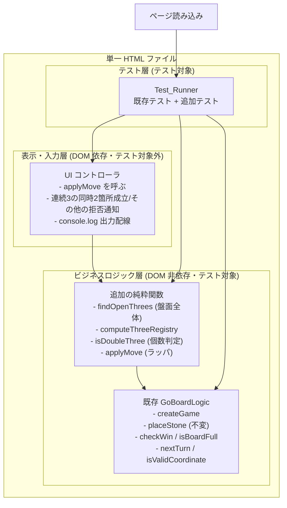

# Design Document

## Overview

本設計は、既存の GoBoard に「連続3が2箇所同時に成立する着手の禁止（Double_Three 禁止）」という
ローカルルールを追加する。

判定の意味論は「盤面全体に存在する Open_Three の総数」で定義する。Black_Player の 1 手を
適用した後の盤面全体に、黒の Open_Three が合計 2 個以上存在し（Double_Three）、かつその着手が
Win_Condition を成立させないならば、当該着手を無効として Stone を配置しない。判定は着手点を通る
Line 方向の数ではなく、盤面全体に存在する黒 Open_Three の総数で行う。複数の Open_Three が
互いに交わる必要はなく、離れた位置にある 2 個でも Double_Three とみなす（要件 1.1, 1.5）。

ここでの Open_Three は、同色の Stone が「ちょうど 3 個連続」した並び（●●●）であり、途中に空を
挟む飛び三（●●_●）は含めない。加えて、その並びの少なくとも一方の端が空で、かつその端側へ
延長すると相手 Stone または盤端に妨げられずに同色 4 連を作り得る（延長可能）ことを要する。
両端が塞がれて 4 連を作り得ない並びは Open_Three ではない。

盤面上で成立している Open_Three の位置を黒・白それぞれについて記憶する Three_Registry を導入し、
着手が確定するたびに確定後盤面全体から再計算する。この Three_Registry は、連続3の同時2箇所成立の禁止の判定と
console.log 出力の双方が参照する唯一の情報源とする。すなわち、ログに出力される Open_Three の
個数と、禁止判定に用いる個数は常に同一であり、両者は一致する（要件 2.2, 3.3）。

設計の最重要方針は、既存ロジックへの影響範囲を最小化することである（要件 5）。
既存の `placeStone` の署名・振る舞いは、Black_Player の Double_Three ケースを除いて一切変更しない。
連続3の同時成立の判定・Three_Registry の再計算・ログ出力・拒否メッセージはいずれも **追加的（additive）** な
純粋関数および薄いラッパとして実装し、既存の盤面初期化・交互着手・妥当性検証・勝敗判定・
引き分け判定の内部を書き換えない。

実装は引き続き HTML + CSS + JavaScript の 1 ファイル構成を維持し、外部ライブラリおよび CDN を
一切使用しない。追加するビジネスロジックはすべて DOM に依存しない純粋関数として切り出し、
ページ読み込み時の自動テストから参照できる形にする。

### 設計上の主要な決定

| 決定 | 理由 |
|------|------|
| 連続3の同時成立の判定を `placeStone` 内部に混ぜず、新しいラッパ関数 `applyMove` で層として重ねる | 既存 `placeStone` の署名・振る舞いを不変に保ち、回帰リスクを最小化する（要件 5.1, 5.2） |
| Double_Three の判定を、着手点を通る方向検出ではなく、確定後盤面全体の当該色 Open_Three 総数から導く | 新ルールの意味論（盤面全体の個数、離れた 2 個も対象）に一致させる（要件 1.1, 1.5） |
| 判定と console.log 出力の双方が Three_Registry を唯一の情報源として参照する | ログの個数と禁止判定を常に一致させる（要件 2.2, 3.3） |
| Open_Three 検出・Three_Registry 再計算を独立した純粋関数として切り出す | DOM 非依存で単体・プロパティテストが可能になり、判定と登録処理を局所化できる（要件 5.3） |
| 連続3の同時2箇所成立の禁止用に新しい InvalidReason（`DOUBLE_THREE`）を追加する | 既存の拒否理由（OCCUPIED 等）と区別でき、通知領域で別メッセージを提示できる（要件 4.2, 4.3） |
| Win_Condition を連続3の同時成立の判定より先に評価する | 5 連が成立する着手は連続3の同時2箇所成立の禁止より優先して勝ちとする（要件 1.4） |
| Three_Registry は確定後の盤面全体を走査して毎回再計算し、その結果を Open_Three のみで構成する | 差分更新の複雑さを避け、確定後盤面と登録内容の一致を保証する。この登録内容を禁止判定にも用いる（要件 2.2, 2.4） |
| ログ出力・拒否メッセージ表示は UI/起動配線側で行い、純粋関数は値を返すだけにする | ビジネスロジックの DOM 非依存を維持する（要件 5.3） |

## Architecture

既存の 3 層構造（ビジネスロジック層・テスト層・表示/入力層）を維持し、
本機能はビジネスロジック層への **追加関数** と、表示/入力層・起動配線での
**ログ出力および通知の分岐** として組み込む。



着手処理の流れ（UI からの 1 クリック）:

1. UI コントローラは `placeStone` ではなく新しいラッパ `applyMove(state, row, col)` を呼ぶ。
2. `applyMove` は内部で既存 `placeStone` を呼び、まず基本ルール（進行中判定・座標・既石・
   勝敗・引き分け・手番切替）の結果を得る。
3. `placeStone` が無効を返した場合は、その結果をそのまま返す（既存の拒否理由がそのまま伝わる）。
   このとき Three_Registry は着手前の内容のまま返す（要件 2.3, 3.4）。
4. `placeStone` が有効を返した場合、`applyMove` は次の順で処理する。
   - 着手後の Game_Status が Win_Condition（BLACK_WIN 等）なら、連続3の同時2箇所成立の禁止を適用せずその勝ちを
     優先し、確定後盤面から Three_Registry を再計算して有効のまま返す（要件 1.4）。
   - 着手前の手番が Black_Player で、かつ着手が Win_Condition を成立させない場合、確定後盤面から
     Three_Registry を再計算し、**黒の Open_Three 総数 `registry.black.length >= 2`** ならば
     Double_Three として結果を無効（reason=DOUBLE_THREE）に差し替え、状態を **着手前の state** に
     戻し、Three_Registry も着手前の内容に戻して返す（要件 1.1, 1.5, 4.1）。
   - 上記に該当しない（白の着手・黒で黒 Open_Three が 1 個以下の手）は有効のまま受理する
     （要件 1.2, 1.3）。
5. 有効が確定した場合、`applyMove` は確定後盤面から再計算した Three_Registry を結果に含める。
   この Three_Registry は禁止判定に用いたものと同一であり、ログ出力にもそのまま用いられる
   （要件 2.2, 3.3）。
6. UI コントローラは、有効なら盤面・ステータスを再描画し（通知はクリア）、Three_Registry に基づく
   ログを出力する（要件 3.1〜3.3）。無効なら reason に応じた通知を提示し、ログは出力しない
   （要件 3.4, 4.2, 4.3）。

旧設計の「着手点を通る Open_Three が相異なる 2 方向以上で成立するかを検出する」ロジックは、
本設計では「確定後盤面全体の黒 Open_Three 総数が 2 個以上か」で置き換える。方向数ではなく
盤面全体の個数で判定するため、着手点と無関係な既存の黒 Open_Three が別途 1 個存在し、
今回の着手で 2 個目が成立した場合も Double_Three となる（要件 1.5）。

この流れにおいて、既存 `placeStone` は呼び出されるだけで内部は変更されない。連続3の同時2箇所成立の禁止は
`placeStone` が有効と判定した結果を **後段で覆す** 形でのみ介入するため、既存の各判定の
入出力は同一入力に対して同一のまま保たれる（要件 5.2）。

## Components and Interfaces

### 追加する GoBoardLogic 関数（ビジネスロジック層）

いずれも DOM 非依存の純粋関数であり、入力状態を変更せず新しい値を返す。
既存関数（`createGame`, `placeStone`, `checkWin`, `isBoardFull`, `nextTurn`, `isValidCoordinate`）は
そのまま維持し、以下を `GoBoardLogic` の公開 API に追加する。

旧設計にあった `detectOpenThrees(board, row, col, color)`（着手点を通る成立方向の集合を返す
API）は、新ルールでは禁止判定に用いないため **廃止** する。1 本の Line 上で連続 3・延長可能な
端を判定する処理は、盤面全体を走査する `findOpenThrees` の内部ヘルパとしてのみ用いる。
旧 `findThreeInARow`（連続 3 と飛び三の双方を数える）は、意味論を Open_Three に限定した
`findOpenThrees` へ **改名・再定義** する。旧 `isDoubleThreeMove(board, row, col, color)`
（方向数 >= 2 判定）は廃止し、盤面全体の個数に基づく `isDoubleThree(board, color)` へ
**再定義** する。

```javascript
/**
 * 盤面全体を走査し、指定色の Open_Three（同色ちょうど 3 個連続かつ延長可能な開いた端を持つ並び）
 * の位置集合を返す。飛び三（●●_●）および両端が塞がれた 3 連は含めない。盤面は変更しない。
 * 各 Open_Three は、それを構成する 3 交点の正規化された座標列で一意に表す。
 * @param {Board} board            走査対象の盤面
 * @param {Color} color            対象の色
 * @returns {OpenThree[]}          重複を含まない Open_Three の集合
 */
function findOpenThrees(board, color)

/**
 * 確定後の盤面から黒・白それぞれの Open_Three 位置集合を再計算し、
 * Three_Registry を新規に構築して返す。連続3の同時2箇所成立の禁止の判定とログ出力の双方が参照する
 * 唯一の情報源となる。
 * @param {Board} board            確定後の盤面
 * @returns {ThreeRegistry}        黒・白を区別した Open_Three の集合
 */
function computeThreeRegistry(board)

/**
 * 指定色の Open_Three が盤面全体に 2 個以上存在する（Double_Three か）を判定する。
 * 盤面全体の個数のみで判定し、着手点や方向は参照しない。
 * @param {Board} board            判定対象の盤面（着手を反映済みの盤面を渡す）
 * @param {Color} color            判定対象の色
 * @returns {boolean}              当該色の Open_Three が 2 個以上なら true
 */
function isDoubleThree(board, color)

/**
 * 連続3の同時2箇所成立の禁止ローカルルールを含めて着手を適用するラッパ。
 * 内部で既存 placeStone を呼び、その有効結果に対してのみ Three_Registry を再計算し、
 * 黒の非勝ち着手について registry.black.length >= 2 なら DOUBLE_THREE で拒否する。
 * placeStone 自体は変更しない。
 * @param {GameState} state        現在のゲーム状態
 * @param {number} row             行番号
 * @param {number} col             列番号
 * @returns {LocalMoveResult}      着手の可否・理由・新状態・Three_Registry
 */
function applyMove(state, row, col)
```

`isDoubleThree` は `computeThreeRegistry(board)[color].length >= 2` と論理的に同値である。
唯一の情報源を保つため、`applyMove` 内では確定後盤面から Three_Registry を 1 回だけ計算し、
その `registry[color].length >= 2` を直接参照して禁止判定を行うことを推奨する。単体で色ごとの
個数判定が必要な場面のために `isDoubleThree` を公開 API として残すが、`applyMove` の実装は
再計算済み Three_Registry の個数を用いる。

### 拡張する MoveResult（LocalMoveResult）

`applyMove` は既存 `MoveResult`（`valid`, `reason`, `state`）を包含しつつ、確定後の
Three_Registry を追加で返す。既存 `placeStone` の返り値形は変更しない。

```javascript
/**
 * @typedef {Object} LocalMoveResult
 * @property {boolean} valid              着手が有効だったか
 * @property {string|null} reason         無効理由コード（valid が false のとき）
 * @property {GameState} state            着手後の状態（無効時は着手前と同一内容）
 * @property {ThreeRegistry} registry     確定後盤面に基づく Three_Registry
 *                                        （無効時は着手前の Three_Registry と同一内容）
 */
```

無効理由コードは既存の 4 種に加え、連続3の同時2箇所成立の禁止用の 1 種を追加する。

| reason コード | 意味 | 追加/既存 | 対応要件 |
|---------------|------|-----------|----------|
| `OCCUPIED` | 既に石がある交点への着手 | 既存 | 4.3 |
| `OUT_OF_BOUNDS` | 行または列が 0〜14 の範囲外 | 既存 | 4.3 |
| `INVALID_COORDINATE` | 行または列が整数でない値 | 既存 | 4.3 |
| `NOT_IN_PROGRESS` | ゲームが進行中でない状態での着手 | 既存 | 4.3 |
| `DOUBLE_THREE` | Black_Player の着手後、盤面全体の黒 Open_Three が 2 個以上（非 Win_Condition） | 追加 | 1.1, 4.2 |

### UI コントローラ（表示・入力層）

既存の責務に、次の分岐を **追加** する。ビジネスロジックは値を返すだけとし、
DOM 参照・console 出力の副作用は本層に閉じる（要件 5.3）。

- クリック時に `placeStone` ではなく `applyMove` を呼ぶ。
- 有効な着手: 盤面・ステータスを再描画し、通知領域をクリアする（要件 4.4）。続けて、
  返された Three_Registry を用いて黒・白それぞれの Open_Three の有無と個数を
  console.log へ出力する（要件 3.1〜3.3）。ここで出力する個数は禁止判定に用いた個数と同一である。
- 無効な着手: reason に応じたメッセージを通知領域（#gb-notice）へ提示する。
  `DOUBLE_THREE` は「連続3の同時2箇所成立の禁止により着手できない」旨の、他の拒否理由と区別できる
  メッセージにする（要件 4.2, 4.3）。この場合、Open_Three の有無ログは出力しない（要件 3.4）。

### Test_Runner（テスト層）

既存の `test` / `assertEqual` / `runTests` および `GB_GEN` をそのまま用い、
本機能のプロパティテスト・単体テストを **追加登録** する。既存の 32 件の基本テストは変更せず、
すべて成功させ続ける（要件 5.5, 6.6）。本ローカルルールに関するテストは、新しい全盤面
Open_Three 個数の意味論に合わせて再定義してよい（要件 5.6）。

## Data Models

既存の `Color` / `CellState` / `GameStatus` / `Board`（`BOARD_SIZE=15`, `WIN_LENGTH=5`）/
`GameState` / `DIRECTIONS`（横・縦・右下がり斜め・右上がり斜めの 4 方向）はすべて維持する。
本機能では次の定数・型を追加する。

### THREE_LENGTH（Open_Three の長さ）

Open_Three の判定に用いる「ちょうど 3 個連続」という長さ定数。

```javascript
/** Open_Three を構成する同色連続数。 */
const THREE_LENGTH = 3;
```

### InvalidReason の拡張

既存の `InvalidReason` に連続3の同時2箇所成立の禁止の理由コードを 1 つ追加する。既存値は変更しない。

```javascript
const InvalidReason = Object.freeze({
  OCCUPIED: 'OCCUPIED',
  OUT_OF_BOUNDS: 'OUT_OF_BOUNDS',
  INVALID_COORDINATE: 'INVALID_COORDINATE',
  NOT_IN_PROGRESS: 'NOT_IN_PROGRESS',
  DOUBLE_THREE: 'DOUBLE_THREE', // 追加：Black_Player の連続3の同時2箇所成立の禁止
});
```

### OpenThree（旧 ThreeInARow の再定義）

盤面上で成立している 1 つの Open_Three を、それを構成する 3 交点の座標列で表す。
本仕様における Open_Three は「同色ちょうど 3 個の連続」であり、飛び三は含めない。したがって
構成 3 交点は Line 上で隙間なく連続する。加えて、少なくとも一方の端が空で延長可能である
（下記アルゴリズム参照）。同一の並びを一意に識別できるよう、座標列は正規化する。

```javascript
/**
 * @typedef {Object} OpenThree
 * @property {Color} color                        並びの色
 * @property {{row:number, col:number}[]} cells   構成する 3 交点（連続・正規化済み・昇順）
 * @property {string} key                         重複排除用の正規化キー文字列
 */
```

旧設計の `ThreeInARow`（連続 3 と飛び三の双方を含む型）は、本設計では飛び三を含まない
`OpenThree` として **再定義** する。要件の Glossary では Three_In_A_Row と Open_Three を同義と
するため、コード上の型名は `OpenThree` に統一する。

### ThreeRegistry

黒・白それぞれの Open_Three 集合を区別して保持する。同一の Open_Three を重複して
持たない（要件 2.4）。連続3の同時2箇所成立の禁止の判定とログ出力はいずれもこの Three_Registry を参照する。

```javascript
/**
 * @typedef {Object} ThreeRegistry
 * @property {OpenThree[]} black   黒の Open_Three 集合（重複なし）
 * @property {OpenThree[]} white   白の Open_Three 集合（重複なし）
 */
```

初期状態（新規ゲーム開始時）は黒・白いずれも空配列とする（要件 2.1）。
`createGame` は既存どおり GameState のみを返し、Three_Registry は UI/起動配線側で
`computeThreeRegistry(createGame().board)`（＝空盤に対して黒・白とも 0 個）として初期化する。
これにより `createGame` の署名・振る舞いは不変に保たれる（要件 5.2）。

## Open_Three 検出アルゴリズム

本設計の Open_Three 検出は、着手点を通る特定方向の判定ではなく、**盤面全体の列挙** である。
`findOpenThrees(board, color)` がこの列挙を担い、`computeThreeRegistry` がそれを黒・白に対して
呼ぶ。連続3の同時2箇所成立の禁止の判定も、この列挙結果（Three_Registry）の個数から導く。

### 用語と前提

- 方向は `DIRECTIONS` の 4 つ（横・縦・右下がり斜め・右上がり斜め）。各方向は `{dr, dc}` の
  1 本の Line を表し、Line 上を走査して連続 3 の窓を探す。
- 判定対象は「同色ちょうど 3 個が隙間なく連続する並び（●●●）」に限る。飛び三（●●_●）は
  Open_Three に含めない。

### 判定手順（1 本の Line 上の連続 3 窓）

盤面上の各交点を起点に、各方向 `d = {dr, dc}` について次を評価する。窓の重複走査は
正規化キーによる重複排除で吸収する。

1. **連続 3 の窓の抽出**: 起点から方向 `d` に 3 マス連続して同色 `c` の石が並ぶ窓
   `(p0, p1, p2)` を候補とする（相手石・空を含む窓は候補としない）。
2. **端の延長可能性（Open 条件）**: 窓の前端外側 1 マス `before`（= `p0` の一つ手前）と
   後端外側 1 マス `after`（= `p2` の一つ次）を調べる。少なくとも一方が
   「盤内かつ空 Intersection」であり、その端側へ石を置くことで同色 4 連を新たに作り得るとき、
   その窓を Open_Three とみなす。
   - `before` が盤内かつ空なら、前端側へ延長して 4 連を作り得る（前端が開いている）。
   - `after` が盤内かつ空なら、後端側へ延長して 4 連を作り得る（後端が開いている）。
   - 前端外側・後端外側がいずれも相手 Stone または盤端で塞がれている場合は延長不能であり、
     Open_Three ではない（要件の Glossary に準拠）。
3. **正規化と登録**: Open_Three と判定した窓は、構成 3 交点 `(p0, p1, p2)` の座標を昇順に
   正規化してキー化し、集合に追加する。同一の 3 石集合は走査の起点・方向の取り方によらず
   同じキーを持つため、集合として重複しない。

`findOpenThrees(board, color)` は上記を盤面全体・全方向に適用し、重複排除した
`OpenThree[]` を返す。旧設計にあった飛び三（single-gap-3）の判定パスは削除する。

### Double_Three 判定

Double_Three の判定は、着手点を通る方向数ではなく、確定後盤面全体の当該色 Open_Three 総数で
行う。すなわち、黒の着手を適用した後の盤面で `computeThreeRegistry(board).black.length >= 2`
（`isDoubleThree(board, Color.BLACK)` と同値）であり、かつ当該着手が Win_Condition を成立させない
とき、その着手を Double_Three として拒否する（要件 1.1）。

盤面全体の個数で判定するため、**副作用として** 着手点と無関係な既存の黒 Open_Three が 1 個
存在し、今回の着手が離れた位置に 2 個目の黒 Open_Three を成立させた場合も、盤面全体の黒
Open_Three が 2 個となり Double_Three として拒否される（要件 1.5）。2 個の Open_Three が共通の
Intersection を持つ必要はない。

Win_Condition 優先の扱いは `applyMove` 側で行う。着手後の盤面で `checkWin` が真（5 連成立）と
なる場合、Open_Three の総数にかかわらず連続3の同時2箇所成立の禁止を適用しない（要件 1.4）。

## Three_Registry の正規化と再計算

### Open_Three の正規化

同一の並びを重複なく一意に識別するため、Open_Three を構成する 3 交点の座標列を
`(row, col)` の辞書順で昇順ソートし、その並びを重複排除キー `key` とする（要件 2.4）。
本設計の Open_Three は連続 3 のみであり内部に空を含まないため、キーは実在する 3 石の
座標のみで構成される。同一の 3 石集合は、走査の起点や方向の取り方によらず同じ `key` を
持つため、集合として重複しない。

### computeThreeRegistry

`computeThreeRegistry(board)` は確定後の盤面全体を走査し、黒・白それぞれについて
`findOpenThrees(board, color)` を呼んで Open_Three を列挙し、`key` により重複排除した
`{ black: OpenThree[], white: OpenThree[] }` を新規構築して返す（要件 2.2）。
本関数は盤面を変更せず、既存の Three_Registry も参照しないため、確定後盤面に対して
毎回同じ結果を返す（要件 2.2, 2.4）。この返り値が、禁止判定（黒の個数 >= 2）とログ出力の
双方の唯一の情報源となる（要件 3.3）。

`applyMove` は、着手が有効に確定したときのみこの関数を呼んで新しい Three_Registry を作る。
着手が無効（既石・範囲外・不正座標・終局・連続3の同時2箇所成立の禁止）の場合は再計算せず、着手前の
Three_Registry と同一内容を返す（要件 2.3, 3.4）。

## Correctness Properties

*プロパティとは、システムのすべての妥当な実行にわたって成り立つべき特性や振る舞いのことである。
すなわち、システムが何をすべきかについての形式的な言明であり、人間が読める仕様と
機械的に検証可能な正しさの保証との橋渡しとなる。*

以下のプロパティは、DOM に依存しない追加の純粋関数（`applyMove`, `findOpenThrees`,
`isDoubleThree`, `computeThreeRegistry`）に対して定義される。
各プロパティはプロパティベーステスト（最低 100 回のランダム反復）として実装される。

### Property 1: 黒の連続3が2箇所成立する着手は無効となり状態を変えない

*任意の* 進行中の GameState と、Black_Player の手番における空交点への着手について、
その着手を適用した後の盤面全体に黒の Open_Three が合計 2 個以上存在し、かつ Win_Condition を
成立させないならば、`applyMove` の結果は valid=false・reason=DOUBLE_THREE となり、
盤面・Current_Turn・Game_Status・Three_Registry はいずれも着手前と等しいまま保持される。

**Validates: Requirements 1.1, 4.1**

### Property 2: 黒 Open_Three が 1 個以下となる着手は受理される

*任意の* 進行中の GameState と、Black_Player の空交点への着手について、
その着手を適用した後の盤面全体に黒の Open_Three が合計 1 個以下しか存在せず、かつ
Win_Condition を成立させないならば、`applyMove` の結果は valid=true となり、当該交点に
黒の Stone が配置される。

**Validates: Requirements 1.2**

### Property 3: 白の連続3が2箇所成立する着手は受理される

*任意の* 進行中の GameState で Current_Turn が White_Player のとき、
着手を適用した後の盤面全体に白の Open_Three が合計 2 個以上存在しても、`applyMove` は
連続3の同時2箇所成立の禁止を適用せず valid=true となり、当該交点に白の Stone が配置される。

**Validates: Requirements 1.3**

### Property 4: Win_Condition は連続3の同時2箇所成立の禁止より優先される

*任意の* 進行中の GameState と、Black_Player の空交点への着手について、
その着手が Double_Three（着手後の黒 Open_Three が 2 個以上）を成立させ、かつ同一の着手が
いずれかの Line 上で同色 5 個以上の連続（Win_Condition）を成立させるならば、`applyMove` は
valid=true となり、当該交点に黒の Stone を配置し、Game_Status を BLACK_WIN に設定する。

**Validates: Requirements 1.4**

### Property 5: 有効着手後の Three_Registry は確定後盤面と一致する

*任意の* 有効な着手について、`applyMove` が返す Three_Registry の黒・白の各集合は、
確定後盤面に対して `computeThreeRegistry` を独立に適用した結果と等しい（同一の位置集合を持つ）。

**Validates: Requirements 2.2**

### Property 6: 無効着手では Three_Registry が変化しない

*任意の* 無効な着手（既石・範囲外・不正座標・終局・黒の連続3が2箇所成立する着手のいずれか）について、
`applyMove` が返す Three_Registry は着手前の Three_Registry と等しいまま変化しない。

**Validates: Requirements 2.3, 3.4**

### Property 7: Three_Registry は色ごとに分離され重複を持たない

*任意の* 盤面について、`computeThreeRegistry` が返す Three_Registry は、黒の集合には黒の
Open_Three のみ・白の集合には白の Open_Three のみを含み、各集合内に同一の Open_Three
（同一の正規化キー）を重複して持たず、各要素は当該色の妥当な Open_Three である。

**Validates: Requirements 2.4**

### Property 8: 検出される並びは常に延長可能な連続 3 の Open_Three である

*任意の* 盤面と色について、`findOpenThrees(board, color)` が返す各要素は、当該色の
ちょうど 3 個が Line 上で隙間なく連続し、かつ少なくとも一方の端が盤内の空 Intersection で
延長可能な並びである。飛び三、および両端が相手 Stone・盤端で塞がれた連続 3 は返されない。

**Validates: Requirements 1.1, 2.2**

### Property 9: 黒の連続3が2箇所成立する着手以外では applyMove は placeStone と同一の可否・状態を返す

*任意の* GameState と着手について、その着手が「Black_Player の連続3が2箇所成立する着手（着手後の黒 Open_Three が
2 個以上）かつ非 Win_Condition」に該当しないならば、`applyMove` の valid・reason・
state（board / currentTurn / status）は、既存 `placeStone` を同一入力で呼んだ結果と等しい。

**Validates: Requirements 5.2**

### Property 10: 禁止判定は Three_Registry の黒個数と一致する（唯一の情報源）

*任意の* 進行中の GameState と Black_Player の非 Win_Condition の空交点着手について、
`applyMove` が DOUBLE_THREE で拒否することと、確定後盤面に対する
`computeThreeRegistry(board).black.length >= 2` が真であることは同値である。すなわち、
ログに出力される個数と禁止判定に用いる個数は常に一致する。

**Validates: Requirements 1.1, 3.3**

## Error Handling

エラー処理は既存方針を踏襲し、例外を投げず結果値（`LocalMoveResult`）で表現する。
連続3の同時2箇所成立の禁止も「例外ではなく無効理由」として扱う。

| 状況 | 扱い | 対応要件 |
|------|------|----------|
| 黒の着手後、盤面全体の黒 Open_Three が 2 個以上（非 Win_Condition） | `applyMove` が valid=false, reason=DOUBLE_THREE を返し、状態と Three_Registry は不変 | 1.1, 1.5, 4.1 |
| 黒の Open_Three 2 個以上かつ Win_Condition | 連続3の同時2箇所成立の禁止を適用せず valid=true, status=BLACK_WIN を返す | 1.4 |
| 白の着手後、盤面全体の白 Open_Three が 2 個以上 | 連続3の同時2箇所成立の禁止を適用せず valid=true を返す | 1.3 |
| 既石・範囲外・不正座標・終局での着手 | 既存 `placeStone` の無効結果をそのまま伝え、Three_Registry は不変 | 2.3, 4.3 |
| 無効な着手全般 | Open_Three の有無ログを出力しない | 3.4 |
| 追加テストの失敗 | Test_Runner が失敗を記録・出力するが例外を外へ伝播させない | 5.5, 6.6 |

`findOpenThrees` / `computeThreeRegistry` / `isDoubleThree` / `applyMove` はいずれも入力状態を
破壊しない。`applyMove` は無効時に着手前の `state` を内容等価で返し、既存 `placeStone` と
同じく入力の GameState を変更しない。

## Testing Strategy

### テスト方針

本機能で追加するビジネスロジック（盤面全体の Open_Three 列挙・Double_Three 個数判定・
Three_Registry 再計算・`applyMove` ラッパ）は DOM 非依存の純粋関数であり、入力に応じて挙動が
変わる不変条件・同値関係・確定後盤面との一致などを多く含むため、プロパティベーステスト（PBT）が
適切である。DOM 操作・描画・イベントハンドリング・通知表示（要件 4.2〜4.4 の表示）および
console.log 出力の副作用（要件 3.1〜3.3）は UI/起動配線層の責務であり、自動テストの対象外とする
（steering の方針に準拠）。

テストはブラウザ標準 API のみで実装し、外部テストランナー・CDN は使わない。テストコードは
同一 HTML ファイル内に記述し、ページ読み込み時に UI 初期化前へ同期実行する。既存の
`test` / `assertEqual` / `runTests` / `GB_GEN` を再利用し、追加分を登録する（要件 5.5, 6.6）。

### プロパティベーステスト

- 対象言語は JavaScript。既存の自前ジェネレータ方式（`Math.random` ベースの `GB_GEN`）を用い、
  外部ライブラリは使用しない。
- 各プロパティテストは最低 100 回のランダム反復を行う。
- 各プロパティテストには、対応する設計プロパティを参照するコメントを付与する。
- コメントのタグ形式: `Feature: local-rules, Property {番号}: {プロパティ本文}`
- 上記の各 Correctness Property を、それぞれ 1 つのプロパティベーステストとして実装する。

追加が必要なジェネレータの設計要点:

- 黒の着手で盤面全体の黒 Open_Three が 2 個以上となる盤面と着手を生成する。着手点を通る
  十字（縦横 2 方向）で 2 個成立させる形と、着手点と無関係な既存 Open_Three を 1 個
  先置きしておき、今回の着手で 2 個目を成立させる形の双方を含める。
- 「既存の黒 Open_Three 1 個 ＋ 離れた位置に 2 個目を作る着手」を明示的に構成する
  ジェネレータ／例を用意し、盤面全体個数の意味論（離れた 2 個も対象）を検証する。
- 黒の着手で盤面全体の黒 Open_Three が 1 個以下に収まる盤面と着手を生成する。
- 白の着手で盤面全体の白 Open_Three が 2 個以上となる盤面（手番を白に設定）を生成する。
- 黒の Open_Three が 2 個以上かつ着手が 5 連にもなる盤面（Win_Condition と連続3の2箇所成立が同時成立）を
  生成する。
- 連続3の同時成立の判定に無関係な、既存 `GB_GEN.randomInProgressState` 由来のランダム進行中盤面を用い、
  Property 9（回帰）の入力とする。

### 単体テスト（例・エッジケース）

プロパティで覆いにくい決定的なケースは例ベースの単体テストで補う。

| テスト | 内容 | 対応要件 |
|--------|------|----------|
| 連続 3 の Open_Three 検出 | `_ X X X _` 形の連続 3 を、端が開いた Open_Three として検出する | 1.2 |
| 両端が塞がれた連続 3 は非 Open_Three | 相手石・盤端で両端が塞がれた `O X X X O` 形の連続 3 を Open_Three と判定しない | 1.1 |
| 典型的な黒の連続3が2箇所成立する着手の拒否 | 着手点で縦横 2 方向の黒 Open_Three が同時成立する着手を DOUBLE_THREE で拒否 | 1.1, 4.1, 6.2 |
| 全盤面個数: 離れた 2 個で拒否 | 既存の黒 Open_Three 1 個に加え、離れた位置に 2 個目を作る黒着手を DOUBLE_THREE で拒否 | 1.5, 6.5 |
| 黒 Open_Three 1 個以下の受理 | 着手後の盤面全体の黒 Open_Three が 1 個以下となる黒着手を受理 | 1.2, 6.3 |
| 白の連続3が2箇所成立する着手の受理 | 白の Open_Three 2 個以上となる白着手を受理し石を配置 | 1.3, 6.4 |
| Win 優先 | 黒の Open_Three 2 個以上かつ 5 連の着手で BLACK_WIN になる | 1.4 |
| 初期 Three_Registry | 空盤の Three_Registry が黒・白とも 0 個 | 2.1 |
| Registry の重複排除 | 同一の連続 3 を異なる走査経路で数えても 1 件になる | 2.4 |
| 既存回帰 | 既存の 32 件の基本テストが引き続きすべて成功する | 5.5, 6.1 |

要件 6.1〜6.5 が求める回帰確認（空交点への配置・手番交互・4 方向 5 連・黒の連続3が2箇所成立する着手の拒否・
黒 Open_Three 1 個以下の受理・白の連続3が2箇所成立する着手の受理・離れた 2 個の拒否）は、既存テストの維持と上記の
追加テストによって満たす。要件 6.6（テスト失敗時も例外を送出せず起動継続）は既存の
`runTests` / `startup` 配線で担保する。
