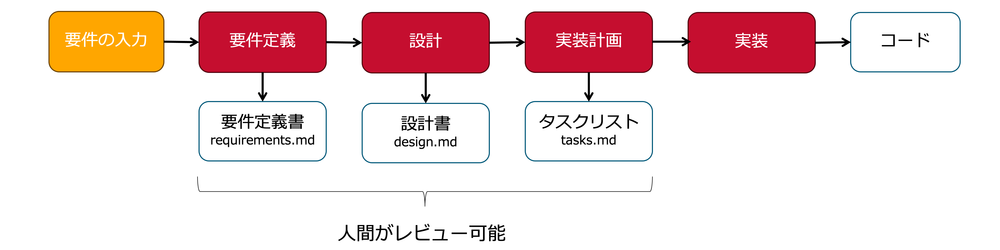
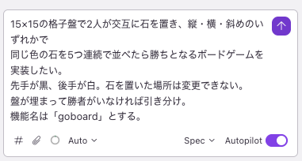
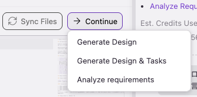

<!-- _class: title invert -->
<!-- paginate: false -->

# KiroのSpecで「五目並べ」を作ってみる

Satoshi Kaneyasu

---

<!-- _class: compact invert -->

## 目次

- KiroのSpec駆動開発（＝仕様駆動開発）とは
- Vibe Coding との対比
- 仕様駆動開発は何もルールがない場合の型である
- KiroのSpecのディレクトリ構成
- KiroのSpecでローカルルールの追加までやってみるとしたら
- Vibe で Steering を作る
- Specで実装する
- Specで一番見るべきはrequirements.md
- Kiroに採用されているEARS記法
- Specのdesign.mdとtasks.mdはどれぐらい時間をかけて見るべき？
- 新規追加と修正は必ずコミット分けること
- まとめ

---

## KiroのSpec駆動開発（＝仕様駆動開発）とは

「何を作るか」を先に文書化し、それを正解として実装していく開発スタイルです。



---

## Vibe Coding との対比

| | Vibe Coding | Spec 駆動開発 |
|--|-------------|--------------|
| 進め方 | 会話しながら少しずつ | 要件→設計→実装の順に固める |
| 強み | すぐ動くものが見える | 認識のズレが早期につぶせる |
| 弱み | 決めごとが会話に埋もれる | 最初に考えるコストがかかる |

---

## 仕様駆動開発は何もルールがない場合の型である

慣れた人なら Vibe の途中で「仕様書を書かせてからそれを基に実装して」と自然に誘導できます。
つまり Vibe でも仕様書を挟む進め方はできます。

問題は、それが属人的なスキルである点です。

- 全員がその進め方を知っているチームは作りにくい
- 仕様書を挟むタイミングも、粒度も、人によってバラバラになる

仕様駆動開発という「型」があると、チームで共通のやり方を持てます。
Kiro の Spec はその型をツールとして提供しています。

---

## KiroのSpecのディレクトリ構成

Kiroの仕様駆動開発は、機能をSpecという単位で開発します。
SpecはSpecごとにディレクトリが分かれ、中に3つのファイルが生成されます。

```text
/（リポジトリルート）
├── index.html
└── .kiro/
    └── specs/
        ├── goboard/           # 機能①：基本ゲーム
        │   ├── requirements.md   # 何を作るか
        │   ├── design.md         # どう作るか
        │   └── tasks.md          # 何をするか（AIがここを順に実行）
        └── local-rules/       # 機能②：ローカルルール追加
            ├── requirements.md
            ├── design.md
            └── tasks.md
```

3つのファイルを順に承認していくことで、AIが tasks.md に沿って実装を進めます。
コードを書くのは最後だけ、それまでは「言葉で合意する」プロセスです。

---

## KiroのSpecでローカルルールの追加までやってみるとしたら

今日の Vibe ハンズオン（STEP 1〜5）を Spec に置き換えると、こう対応します。

| Vibe ハンズオン | 役割 | Spec での対応 |
|-----------------|------|---------------|
| STEP 1：目的の共有 | Steering | Vibe で Steering を作る |
| STEP 2：実装方針の作成 | Steering | Vibe で Steering を作る |
| STEP 3：最低限の実装 | 実装 | Spec（goboard）で実装する |
| STEP 4：ローカルルールを足す | 実装 | Spec（local-rules）で実装する |

STEP 1・2 はプロジェクトの方針・ルールなので Steering に書くのが自然です。
Steering 自体は Vibe で会話しながら作るのがよいでしょう。
STEP 3 以降が Spec の出番です。

---

### やり切った場合のディレクトリ構成

```text
/（リポジトリルート）
├── index.html
└── .kiro/
    ├── steering/
    │   └── product-overview.md   # 目的・技術方針・禁止ワードなど（STEP 1・2 相当）
    └── specs/
        ├── goboard/              # STEP 3：基本ゲームの実装
        │   ├── requirements.md
        │   ├── design.md
        │   └── tasks.md
        └── local-rules/          # STEP 4：ローカルルールの追加
            ├── requirements.md
            ├── design.md
            └── tasks.md
```

---

## Vibe で Steering を作る

Steering はプロジェクト全体に適用されるルール・方針です。
まず Vibe で会話しながら内容を決め、
`.kiro/steering/product-overview.md` に記録します。

プロンプトの例は[こちら](「五目並べ」プロンプト例%20-%20Spec.md)をご覧ください。

---

## Specで実装する

Steering ができたら、Specで開発を進めていきます。



---

## Specで一番見るべきはrequirements.md

[requirements.md](.kiro/specs/goboard/requirements.md) は、
次の要素で構成されます。

| 要素 | 何が書かれるか |
|------|----------------|
| Introduction | この機能の概要と目的。何のための機能かを一段落で示す |
| Glossary | 用語集。プロジェクト固有の言葉（例：GoBoard、活三）の定義をそろえる |
| Requirements | 要件の一覧。1件ごとに User Story と Acceptance Criteria を持つ |
| User Story | 要件の目的。「誰が・何をしたい・なぜ」の形で書く |
| Acceptance Criteria | 受入基準。その要件を満たしたと言える条件を EARS 記法で列挙する |

言葉のニュアンスがずれていると、実装にもずれが生じます。
Glossaryの説明に納得できるか・漏れがないか、を確認すると良いです。

---

<!-- _class: compact invert -->

## User Story と Acceptance Criteria

User Story は「誰が・何をしたい・なぜ」の形で書かれます。

```text
（例：プレイヤーが石を置けるようにしたい。そうすることで手番を進められる）
```

Acceptance Criteriaは、1つのUser Storyにつき複数列挙されます。

```text
WHEN プレイヤーが空きマスをクリックしたとき THEN システムはそのマスに石を置く
IF すでに石があるマスをクリックしたなら THEN システムはその操作を受け付けない
```

「何を作るか」が一つずつ明文化されているので、次の2点を確認します。

- 自分がやりたいことが書かれているか
- 何をもって完了と判断するか（受け入れ基準）が自分の認識と合っているか

ここで認識がそろっていれば、実装後に「思ってたのと違う」が起きにくくなります。
OKならば、requirements.mdのContinueで次に進めます。



---

## Kiroに採用されているEARS記法

EARS（Easy Approach to Requirements Syntax）は、
要件を曖昧さなく書くための5つの文型です。
2009年にロールス・ロイス社のAlistair Mavinらが提唱し、
2019年のIEEE要件工学会議で「10年間で最も影響力のある論文」を受賞しています。

---

### 5つの文型

| パターン | テンプレート | 使う場面 |
|----------|-------------|---------|
| 常時 | システムは〜する | 常に成り立つこと |
| イベント駆動 | 〜のとき、システムは〜する | 操作・出来事への反応 |
| 状態駆動 | 〜の間、システムは〜する | ある状態が続く間の動作 |
| オプション機能 | 〜がある場合、システムは〜する | 特定機能がある場合のみ |
| 異常系 | もし〜なら、システムは〜する | 例外・エラーの場合 |

---

### AIに開発させるうえでのメリット

AIは曖昧な指示を推測で補います。
EARS の文型は「誰が・どの条件で・何をすべきか」を1文に収めるので、
推測で埋める余地が減ります。

また、1文が1つの動作に対応するため、そのまま確認（テスト）項目になります。
「実装できた」の判断基準が最初から明文化されている状態で作業を渡せます。

---

### ツール別のEARS対応状況

| ツール | EARS の扱い |
|--------|------------|
| Kiro の Spec | 公式採用。requirements.md の受け入れ基準が EARS ベース |
| GitHub Spec Kit | 標準では非採用。EARS 統合は Issue 提案中、拡張で対応可 |
| AWS AI-DLC（aws-samples） | ADR-020 として EARS を正式採用（2026年7月） |
| AWS AI-DLC（awslabs 公式） | 標準として明示はなし。ワークフロー主体の方法論 |

---

## Specのdesign.mdとtasks.mdはどれぐらい時間をかけて見るべき？

個人的には、半日から1日ぐらいかけて見るものと思っています。
時間がかかるものなので、レビューの挙げ方はチームで協議してください。
自分が説明できないものをレビューに挙げるのはマナー違反です。

Spec駆動開発（仕様駆動開発）は、着実性を重視している手法で、
Vibe より何倍も時間がかかります。
故に、属人性の排除やスキルの補完を求めるのならともかく、
速さを求めること自体がちょっと違います。

---

## 新規追加と修正は必ずコミット分けること

Vibe で修正すると、修正の過程でUIが微妙に変わったりしませんでしたか？
AIは指示した箇所以外も割と豪快に直します。
意図していない変更が混入しやすいので、変更はレビューを通すのが基本です。

今回の五目並べで言うと、次のような進め方が安全です。

| タイミング | やること |
|------------|---------|
| 基本ゲームが動いた時点 | 一旦コミットして動作確認済みの状態を固める |
| ローカルルールを追加するとき | PR を切ってレビューを挟む |

AIに変更させる前に「何を変えるか」を確認し、
変更後も「意図しない箇所が変わっていないか」を確認する習慣が重要です。

---

### ローカルルール追加時に修正方法とリグレッションテストを要件に入れる

ローカルルールは既存のゲームロジックに影響します。
Spec で実装するなら、requirements.md の段階で、
影響範囲を最小にする修正方法をとること、リグレッションテストの要件も入れます。

```text
1. 修正方法：既存のゲームロジックへの影響範囲を最小にする形で追加すること
2. リグレッションテスト：既存の基本ルール（石を置く・手番交替・勝敗判定）が
   従来通り動作することを受け入れ基準として明記すること
```

「影響範囲を最小にすること」「壊れていないこと」を要件として明文化することで、
AIがテストケースを生成する際の基準にもなります。

---

## まとめ

- Spec は「何を作るか」を先に固めてから実装する型。チームで共通のやり方を持てる
- プロジェクト全体の方針（技術スタック・テスト方針など）は Steering に、
  機能ごとの要件は Spec に書く
- Specで一番見るべきはrequirements.md で「やりたいことが書かれているか」
  「完了の判断基準が合っているか」を必ず確認する
- 新規実装と修正は必ずコミットを分け、変更は PR でレビューを挟む
